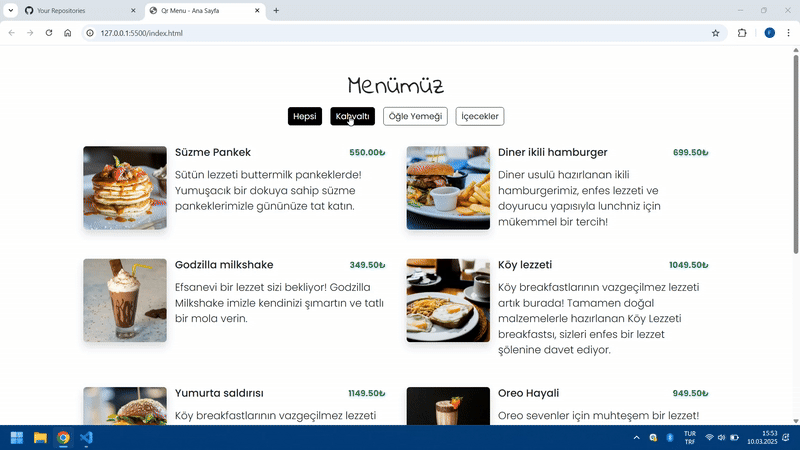

<h1> Qr-Menu </h1>

Bu proje, bir API'den veri alarak dinamik bir menü oluşturmak için geliştirilmiştir. JavaScript kullanılarak yapılan bu projede, kullanıcılar API üzerinden alınan menü öğelerini görüntüleyebilir, filtreleyebilir ve inceleyebilirler.

<h2>Ekran Görüntüsü</h2>

